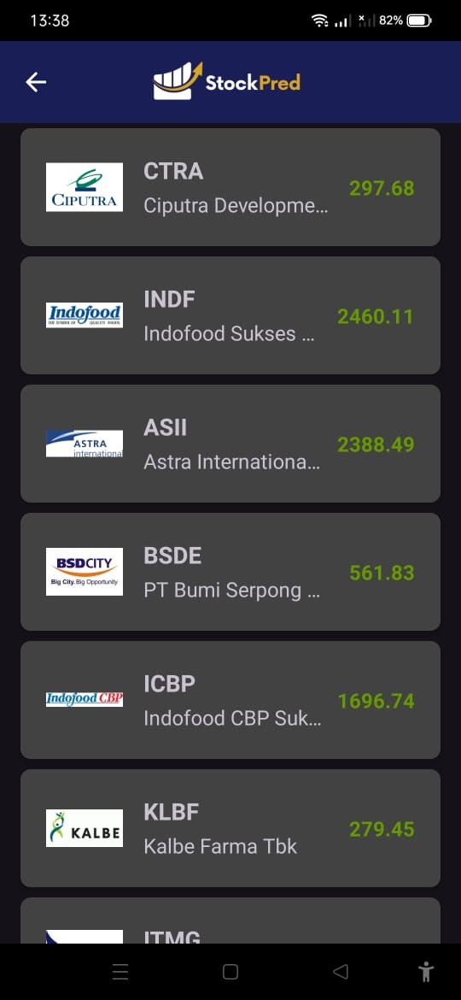

# StockPred Mobile Development Repository


StockPred is a cutting-edge stock prediction tool that utilizes AI to predict stock prices based on macroeconomic factors.

## Built for Bangkit 2024 Batch 2 Capstone Project
This initiative is part of the capstone project for the Bangkit 2024 Batch 2 program.
The UI/UX design for this project is available on [Figma](https://www.figma.com/design/9T7eOKJevGDkT3DXmuTUqA/StockPred-App?node-id=1-3&t=TFf3folQDXNbgEnZ-1).

---

## Screenshots
Here are some screenshots of the StockPred app in action:

   
   
   
   

---

## Features

- **Stock Price Prediction**: The core feature of the app that predicts the price of 20 stocks based on three macroeconomic factors: USD/IDR exchange rate, Bank Indonesia interest rates, and inflation rate.
- **User-Friendly Interface**: A Material Design-based interface ensures an intuitive and easy-to-navigate experience for users to input data and view results.
- **Navigation Toolbar**: Includes a toolbar with back navigation for easy exploration of the app.
- **Loading Indicator**: Displays a loading indicator while fetching stock predictions to enhance user experience.
- **Custom Alert Dialog**: Notifies users with customized alerts for actions like invalid input or failed data retrieval.
- **Data Integration with Backend**: Uses Retrofit for secure, fast, and reliable data transmission from the backend API.

---

## Technologies Used

- **Android Studio**: The primary IDE used for developing the StockPred application.
- **Kotlin**: The programming language used to build the app's functionality.
- **Retrofit**: A library for seamless communication with the backend API, used for fetching stock price predictions.
- **Material Design**: A design system implemented to create a user-friendly and visually appealing interface.
- **Gradle**: Build automation tool used to manage dependencies and compile the app.

---

## Let's Get Started
To get started with the StockPred Mobile Development project, please follow these detailed steps:

1. **Clone the Repository**  
   Clone the repository to your local machine using the following command:
   ```bash
   git clone https://github.com/StockPredBangkit22024/MobileDevelopment.git
   
2. **Install Dependencies**
   Navigate to the project directory and sync the project with Gradle to install the necessary dependencies:
   ```bash
   ./gradlew build

3. **Configure API Keys**  
   If required, add your API keys for the backend API in the appropriate configuration file. Ensure the keys are securely stored and not exposed in the public repository.

4. **Run the Application**  
   You can now run the application either on an Android emulator or a physical device. In Android Studio, click on the "Run" button or use the following command:
   ```bash
   ./gradlew installDebug

# Authors
- Alvian Rofius Salam - Mobile Development - [rougaax](https://github.com/rougaax)
- Candra Bagus Ainur Rochman - Mobile Development - [BatuMalas](https://github.com/BatuMalas)

